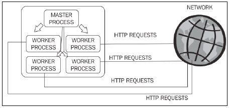

# NGINX

## Giới thiệu về Nginx

Nginx là 1 máy chủ reverse proxy mã nguồn mở cho các giao thức HTTP, HTTPS,...

Nginx sử dụng kiến trúc bất đồng bộ hướng sự kiện linh hoạt (khác với cách truyền thống là xử lý yêu cầu dựa trên luồng)

Khi được khởi chạy service, nginx tạo 1 tiến trình chủ (***Master Process***). Tiến trình này không xử lý bất kì request nào từ phía client mà thay vào đó sẽ tạo ra các tiến trình con (***Worker Process***) để xử lý các request.



## Install Nginx

- Link hướng dẫn: https://www.digitalocean.com/community/tutorials/how-to-install-nginx-on-ubuntu-18-04

## Cách cấu hình Nginx trên server cho app

- Bước 1: Viết file config:
    - Tạo file config:
        ```
        $ sudo nano /etc/nginx/site-available/hello.com
        ```
    
    - Cấu hình cho nginx trên file config:
        - Example:
        ```
        server {
            listen 80;

            root /var/www/hello.com/html;
            index index.html;

            server_name hello.com www.hello.com;

            location / {
                proxy_pass http://127.0.0.1:8080;
                proxy_set_header Host $host;
                proxy_set_header X-Real-IP $remote_addr;
                proxy_set_header X-Forwarded-For $proxy_add_x_forwarded_for;
                proxy_set_header X-Forwarded-Proto $scheme;
                proxy_http_version 1.1;
                proxy_set_header Connection "";
            }
        }
        ```
    
    - Tạo 1 file tương tự tại /etc/nginx/site-enabled/
        ```
        $ ln /etc/nginx/site-available/hello.com /etc/nginx/site-enabled/
        ```

- Bước 2: Run docker container (xem lại hướng dẫn tạo container):
    ```
    $ sudo docker run --publish 8080:8080 --name test --rm myapp
    ```

- Bước 3: Thoát server và restart nginx:
    ```
    - Thoát server
    $ exit
    
    - Restart nginx
    $ sudo systemctl restart nginx
    ```

## Run website with https

- Link hướng dẫn: https://www.digitalocean.com/community/tutorials/how-to-secure-nginx-with-let-s-encrypt-on-ubuntu-18-04